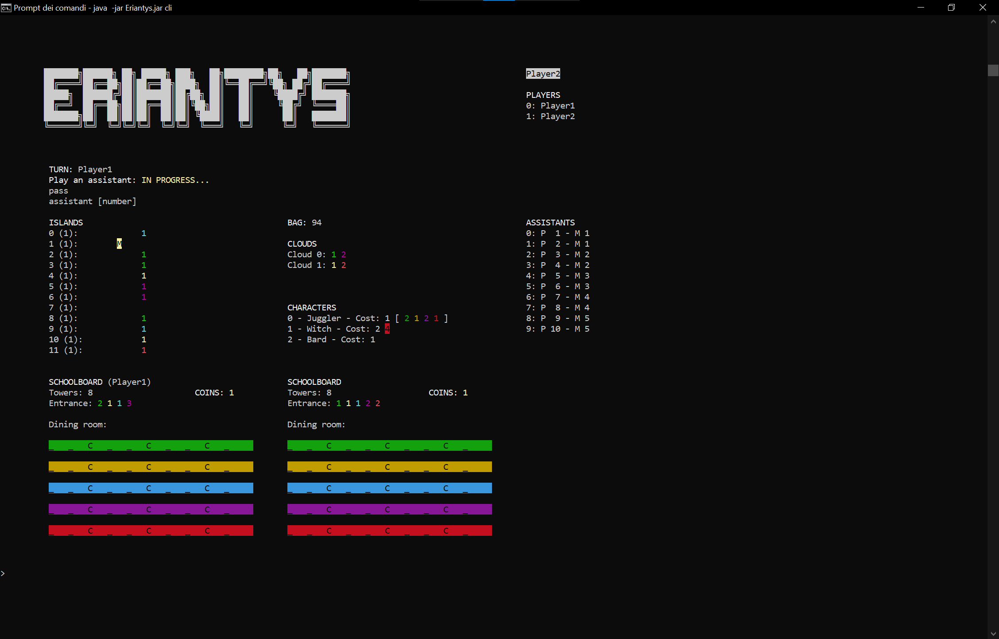
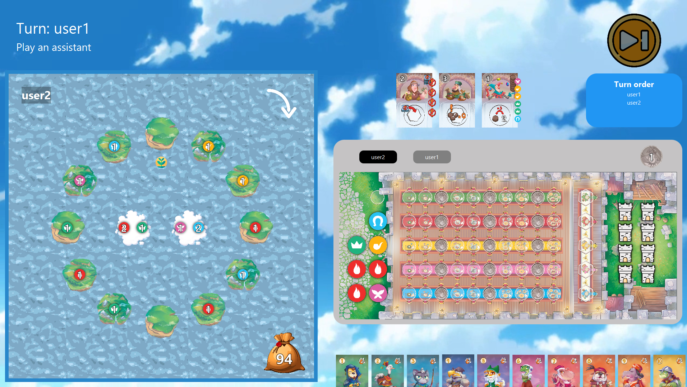

# Prova Finale di Ingegneria del Software 2022

The "Prova Finale di Ingegneria del Software 2022" is the final test of the **Software Engineering** course at Politecnico di Milano.<br>

**Teacher**: Gianpaolo Cugola<br>
**Group**: GC42<br>
**AA:** 2021/22

**Grade:** 30L

## Eriantys


The goal of the project is to program a Java version of the board game [Eriantys](https://craniointernational.com/products/eriantys/), by Cranio Creations.

The project includes:

- Initial UML diagram
- Final UML diagram, generated from the code by automated tools
- Working game implementation
- Source code of the implementation
- Source code of unit tests

## Group members
- [Arturo Benedetti](https://github.com/benedart) - 10747545<br>arturo.benedetti@mail.polimi.it
- [Luca Romanò](https://github.com/LucaRomano2) - 10656514<br>luca8.romano@mail.polimi.it
- [Lorenzo Rossi](https://github.com/tpoppo) - 10698834<br>lorenzo17.rossi@mail.polimi.it

## Implemented functionalities

| Functionality  | State |
|:---------------|:-----:|
| Basic rules    |  🟢   |
| Complete rules |  🟢   |
| Socket         |  🟢   |
| CLI            |  🟢   |
| GUI            |  🟢   |
| All Characters |  🟢   |
| Multiple games |  🟢   |
| Persistence    |  🟢   |

### Legend
🟢 Implemented<br>
🟡 In progress<br>
🔴 Not implemented<br>

## Testing
Extensive testing was performed on all parts of the software, both by writing unit tests and with manual QA.

**Coverage criteria:** code lines

| Package    | Tested Class / Subpackage |   Coverage    |
|:-----------|:--------------------------|:-------------:|
| Controller | Game                      | 231/242 (95%) |
| Model      | Global Package            | 363/398 (91%) |
| Model      | Board                     | 130/144 (90%) |
| Model      | Characters                | 209/223 (93%) |

## Compile

To run the tests and compile the software:

1. Install [Java SE 17](https://www.oracle.com/java/technologies/javase/jdk17-archive-downloads.html)
2. Install [Maven](https://maven.apache.org/install.html)
3. Clone this repo
4. In the cloned repo folder, run:
```bash
mvn clean package
```
5. The compiled artifact (`Eriantys.jar`) will be inside the `target` folder.

## Quick start guide
There is a unique jar file for both the client and the server. Therefore, you have to select which one you want to launch in the arguments.

In order to play, you'll have to launch at least one server and two clients (either CLI or GUI).

In order to play multiplayer from different locations, port forwarding is needed.
### To run the client:
It is possible to set the IP and the port you want to connect to by using the optional argument port and IP.
##### For the CLI:
**Requirement**: a terminal window of at least 150 columns by 55 rows.

In the terminal, run:
```bash
java -jar Eriantys.jar cli [port <port number>] [ip <ip address>]
```


##### For the GUI:
In the terminal, run:
```bash
java -jar Eriantys.jar gui [port <port number>] [ip <ip address>]
```



### To run the sever:
It is possible to set the port you want to use.
In the terminal, run:
```bash
java -jar Eriantys.jar server [port <port number>]
```

## Software used
- **AstahUML**: UML Diagrams
- **IntelliJ IDEA Ultimate**: Main IDE
- **SonarQube**: Code analysis
